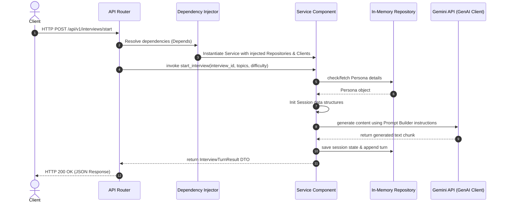
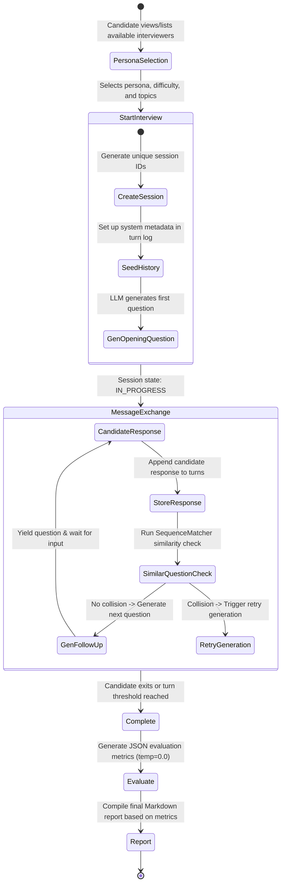

# InterviewVerse AI: System Architecture Documentation

Welcome to the **InterviewVerse AI** backend architecture documentation. This document serves as a comprehensive guide for future developers, code reviewers, and contributors to understand the design, engineering principles, data flow, and roadmap of the InterviewVerse AI system.

---

## 1. System Overview

**InterviewVerse AI** is a production-grade, asynchronous backend API built on FastAPI designed to simulate domain-specific technical and behavioral interviews. By leveraging advanced generative AI models (Gemini) through the official `google-genai` SDK, it provides candidates with realistic, dynamic, and adaptive interview sessions. At the end of each session, the engine evaluates the candidate's answers and generates a highly structured assessment report complete with topic-by-topic grading, strengths, weaknesses, and a personalized learning roadmap.

---

## 2. Project Goals

- **Realistic AI Roleplay**: Deliver highly differentiated interviewer personalities (e.g., warm HR managers, mathematically rigorous ML engineers, or pragmatic startup investors) that adapt to the candidate's input.
- **Dynamic & Non-Repetitive Questioning**: Real-time evaluation of conversation history to ensure follow-up questions build logically on previous responses and never repeat similar questions.
- **Rigorous Evaluation**: Synthesize full transcripts into structured, objective performance metrics using deterministic grading criteria.
- **Clean Architecture & Maintainability**: Strictly decouple API routing, business logic orchestration, prompt building, LLM clients, and data persistence layers.
- **Dependency Injection**: Utilize FastAPI's declarative dependency injection system for modularity, testability, and clean lifecycle management.

---

## 3. Directory Structure

The repository is organized following clean architectural principles:

```text
backend/
├── app/
│   ├── api/                    # Presentation Layer (Routers & Endpoints)
│   │   ├── evaluations/        # Evaluation API routes
│   │   ├── interviews/         # Interview workflow API routes
│   │   ├── personas/           # Persona listing API routes
│   │   ├── reports/            # Report synthesis API routes
│   │   ├── dependencies.py     # Central FastAPI Dependency Injection provider
│   │   ├── exceptions.py       # Global exception handler & HTTP translators
│   │   └── main.py             # FastAPI App definition & startup configuration
│   ├── auth/                   # Authentication & Authorization Subsystem
│   │   ├── hashing.py          # Password hashing utilities using bcrypt
│   │   ├── jwt.py              # JWT encoding/decoding token helpers
│   │   └── router.py           # Registration & authentication router
│   ├── core/                   # Core Infrastructure Config
│   │   ├── config.py           # Settings management via Pydantic Settings & env
│   │   └── logging.py          # Structured JSON logging configurations
│   ├── db/                     # Relational Database Integration
│   │   ├── base.py             # Declarative base class for models
│   │   ├── database.py         # SQLAlchemy engine setup & connection pooling
│   │   └── session.py          # Database session lifecycles (SessionLocal, get_db)
│   ├── models/                 # Database ORM Entities (SQLAlchemy)
│   │   ├── interview_session.py
│   │   ├── message.py
│   │   ├── persona.py
│   │   ├── report.py
│   │   └── user.py
│   ├── schemas/                # Data Transfer DTOs (Pydantic validation schemas)
│   │   ├── evaluations.py
│   │   ├── interviews.py
│   │   ├── personas.py
│   │   ├── reports.py
│   │   └── user.py
│   └── services/               # Core Business Logic Layer (Engine Subsystems)
│       └── ai/
│           ├── conversation/   # Handles conversation turns and history
│           ├── evaluation/     # Orchestrates full-interview evaluation
│           ├── gemini/         # High-level wrapper for Google GenAI SDK
│           ├── interview/      # Coordinates the high-level interview state machine
│           ├── personas/       # Manages interviewer profiles and behaviors
│           ├── prompts/        # Manages prompt templates, registries, and variables
│           ├── reports/        # Generates final markdown assessment reports
│           └── streaming/      # Handles incremental streaming response parsing
├── alembic/                    # Database Migrations folder
│   ├── versions/               # Alembic version files
│   ├── env.py                  # Alembic environment configuration
│   └── script.py.mako          # Alembic script template
├── alembic.ini                 # Alembic configuration
├── tests/                      # Automated Test Suite
│   ├── api/                    # Endpoint / API routing tests
│   ├── integration/            # Multi-service lifecycle workflow tests
│   └── services/               # Component-level isolated unit tests
├── requirements.txt            # Python production & development dependencies
└── pytest.ini                  # Pytest runner configurations
```

---

## 4. Core Platform Architecture

InterviewVerse AI integrates a relational database layer using SQLAlchemy ORM to manage core business entities, accompanied by Alembic for schema migrations and a JWT-based authentication system.

### 1. Database & SQLAlchemy Integration
- **Declarative Base**: The base model class is defined in [base.py](file:///d:/PROJECTS/interviewverse-ai/backend/app/db/base.py) using SQLAlchemy's `DeclarativeBase`. All database-backed entities inherit from this base class.
- **Engine Configuration**: Configured in [database.py](file:///d:/PROJECTS/interviewverse-ai/backend/app/db/database.py), managing database connections using Pydantic settings. For SQLite, `check_same_thread` is disabled to allow async execution, and pool recycle/pre-ping options are configured for client-server databases.
- **Session Lifecycle**: Structured in [session.py](file:///d:/PROJECTS/interviewverse-ai/backend/app/db/session.py) via a session factory `SessionLocal`. The `get_db()` generator serves as a FastAPI dependency that yields a database session and guarantees its closure in a `try/finally` block.

### 2. Alembic Migrations
- **Location**: [`backend/alembic/`](file:///d:/PROJECTS/interviewverse-ai/backend/alembic)
- **Role**: Standardized schema migration runner. Schema version history and deployment updates are handled via Alembic version scripts. The initial database structure containing users, personas, interview sessions, messages, and reports is defined in the version script `7e169c60cd24_create_initial_tables.py`.

### 3. User Model & Entities
Database entities are defined as SQLAlchemy ORM classes in [`backend/app/models/`](file:///d:/PROJECTS/interviewverse-ai/backend/app/models):
- **`User`**: Represents system users owning interview sessions. Declares fields `id` (UUID), `email` (indexed, unique), `full_name`, `password_hash`, `created_at`, and maps a 1-to-many relationship to `InterviewSession`.
- **`Persona`**: Defines the details of an interviewer persona in the database schema.
- **`InterviewSession`**: Links users and personas. Contains metadata like start/end times and holds a 1-to-many relationship with `Message` and 1-to-1 relationship with `Report`.
- **`Message`**: Stores individual conversation turns exchanged within a session.
- **`Report`**: Stores synthesized performance scores (overall, communication, technical, confidence) and text feedback.

### 4. Authentication Subsystem
- **Location**: [`backend/app/auth/`](file:///d:/PROJECTS/interviewverse-ai/backend/app/auth)
- **Password Hashing**: [hashing.py](file:///d:/PROJECTS/interviewverse-ai/backend/app/auth/hashing.py) uses `passlib` with `bcrypt` algorithms to compute secure password hashes and verify candidate credentials.
- **JWT Helpers**: [jwt.py](file:///d:/PROJECTS/interviewverse-ai/backend/app/auth/jwt.py) utilizes `python-jose` to generate signed JSON Web Tokens (JWT) containing expiration (`exp`) times. It handles token validation and signature check exceptions (`ExpiredSignatureError` and `JWTError`).
- **Authentication Routes**: Managed in [router.py](file:///d:/PROJECTS/interviewverse-ai/backend/app/auth/router.py) with endpoints to register users (`/auth/register`), check for duplicates, and save users to the database.

---

## 5. AI Platform Engine Subsystems

The AI features are composed of eight specialized engines with distinct responsibility boundaries:

### 1. Gemini Service
- **Location**: [`services/ai/gemini/`](file:///d:/PROJECTS/interviewverse-ai/backend/app/services/ai/gemini)
- **Role**: Wraps the official `google-genai` SDK Client. It handles low-level HTTP network calls, async streaming (`aio`), and implements robust transient error retry policies using `tenacity` (exponential backoff for rate limits `429` and server errors `5xx`). It maps raw API errors into clean, domain-specific exception models like `GeminiRateLimitError` or `GeminiGenerationError`.

### 2. Prompt Architecture
- **Location**: [`services/ai/prompts/`](file:///d:/PROJECTS/interviewverse-ai/backend/app/services/ai/prompts)
- **Role**: Standardizes how LLM instructions are stored, rendered, and validated.
  - `PromptTemplate`: Pydantic model enforcing structural properties of a prompt.
  - `PromptRegistry`: Bootstraps and registers prompt templates (e.g., `interview_generation`, `interview_evaluation`).
  - `PromptRenderer`: Substitutes template variables safely and verifies all required placeholders are supplied.
  - `PromptBuilder`: Orchestrates the registry and renderer to construct standard, validated `PromptPayload` payloads ready for LLM consumption.

### 3. Persona Engine
- **Location**: [`services/ai/personas/`](file:///d:/PROJECTS/interviewverse-ai/backend/app/services/ai/personas)
- **Role**: Manages profiles of the AI interviewers. It exposes enums (`PersonaType`) and structural models (`Persona`) representing different interviewers. It formats system instructions generically, ensuring the LLM is primed with specific styles, difficulty bounds, and focus topics without exposing builder internals.

### 4. Conversation Engine
- **Location**: [`services/ai/conversation/`](file:///d:/PROJECTS/interviewverse-ai/backend/app/services/ai/conversation)
- **Role**: Handles append-only transaction logs of conversation turns (Interviewer/Candidate). It translates raw model turns into LLM-ready message payloads and utilizes a Sequence Matcher to calculate question similarity metrics. If a newly generated question is structurally similar to an existing turn (above `0.8`), it flags a collision, triggering an automatic prompt regeneration.

### 5. Streaming Engine
- **Location**: [`services/ai/streaming/`](file:///d:/PROJECTS/interviewverse-ai/backend/app/services/ai/streaming)
- **Role**: Manages incremental token streaming. It decodes model chunks, checks sequence numbers, validates terminal chunk boundaries, and safely reconstructs the full text response while protecting client connections from intermediate timeout interruptions.

### 6. Interview Engine
- **Location**: [`services/ai/interview/`](file:///d:/PROJECTS/interviewverse-ai/backend/app/services/ai/interview)
- **Role**: The core coordinator orchestrating active sessions. It enforces interview transitions (e.g., preventing answering once an interview is marked `COMPLETED`), validates inputs, initiates new conversations, updates repositories, and runs retry loops (up to 4 attempts) to ensure all generated questions are unique and non-repetitive.

### 7. Evaluation Engine
- **Location**: [`services/ai/evaluation/`](file:///d:/PROJECTS/interviewverse-ai/backend/app/services/ai/evaluation)
- **Role**: Translates completed conversation transcripts into graded evaluations. It triggers Gemini with a deterministic temperature (`0.0`), injects structured evaluation JSON schemas in the prompt, robustly parses output JSON from markdown code fences or surrounding text, and instantiates structured Pydantic models mapping overall, communication, technical, and confidence scores.

### 8. Report Engine
- **Location**: [`services/ai/reports/`](file:///d:/PROJECTS/interviewverse-ai/backend/app/services/ai/reports)
- **Role**: Synthesizes evaluation and session data into user-facing markdown reports. It deterministically compiles executive summaries, formats score breakdowns, and generates markdown layouts (Strengths, Weaknesses, Roadmap) in a template-driven, non-hallucinated manner based purely on the generated evaluation schemas.

---

## 6. API Layer Architecture

The presentation layer of InterviewVerse AI implements clean routing, aggregates endpoints, dynamically handles dependencies, and translates exceptions to standardized HTTP responses.

### 1. Versioned Routes under `/api/v1`
All business features and authentication endpoints are nested under a versioned path schema. For example:
- `/api/v1/auth/register` (User registration)
- `/api/v1/personas` (List personas & details)
- `/api/v1/interviews` (Start interview, process candidate answers, complete sessions)
- `/api/v1/evaluations` (Retrieve evaluations)
- `/api/v1/reports` (Retrieve generated assessment reports)

### 2. Central `api_router` Aggregation
A centralized router in [__init__.py](file:///d:/PROJECTS/interviewverse-ai/backend/app/api/__init__.py) gathers individual API sub-routers (health, auth, and AI features) and exports them under a single unified router, which the main FastAPI application factory integrates in [main.py](file:///d:/PROJECTS/interviewverse-ai/backend/app/main.py).

### 3. Dependency Injection Architecture
FastAPI's declarative dependency injection framework is fully leveraged to keep routes decoupled from service implementation details:
- **Central Provider**: Factory functions in [dependencies.py](file:///d:/PROJECTS/interviewverse-ai/backend/app/api/dependencies.py) assemble the service dependency graph dynamically.
- **Mocking Support**: The decoupling allows swapping concrete providers with mocks during testing without changing endpoint code.

### 4. Exception Mapping Strategy
Domain-specific exceptions are translated into standard HTTP responses in [exceptions.py](file:///d:/PROJECTS/interviewverse-ai/backend/app/api/exceptions.py):
- **`404 Not Found`**: Triggered when a persona, interview, or evaluation is missing.
- **`409 Conflict`**: Raised when attempting to mutate finished sessions (e.g., `InterviewAlreadyCompletedError`).
- **`400 Bad Request`**: Raised during validation failures or structural inconsistencies.
- **`500 Internal Server Error`**: Catches explicit generation errors or failures in parsing AI JSON structures.

---

## 7. Data Flow & Request Lifecycle

The diagram below depicts the execution path from a client request, through the presentation, dependency injection, and business logic layers, down to external LLM calls and transient persistence.



---

## 8. Interview Lifecycle State Machine

The state diagram below illustrates how an interview session moves through the starting, message-exchanging, and completion/evaluation phases:



---

## 9. Repository State & Migration Path

Currently, data storage is split between the Core Platform and the AI Platform services:

| Component | Current State | Target Future State |
| :--- | :--- | :--- |
| **Core Platform** (Users, Auth records) | Relational Database (SQLAlchemy & Alembic migrations) | SQLite/PostgreSQL database storage |
| **AI Platform** (Conversations, Sessions, Evaluations, Reports) | In-Memory Repositories (Singleton Pattern) | Relational database (SQLAlchemy models) linked via foreign keys |

### In-Memory Singletons
AI repositories (e.g. `PersonaRepository`, `ConversationRepository`, `InterviewRepository`, `EvaluationRepository`) are instantiated as module-level lazy-initialized singletons. For example, in [`conversation/dependencies.py`](file:///d:/PROJECTS/interviewverse-ai/backend/app/services/ai/conversation/dependencies.py), the `get_conversation_repository()` function references a global `_conversation_repository` object. This ensures that throughout the entire application lifecycle, all requests access the same in-memory dictionaries, preserving conversation history across multiple REST API invocations.

### Database-Backed Core Entities
Database schemas for relational persistence are defined in [`app/models`](file:///d:/PROJECTS/interviewverse-ai/backend/app/models). These SQLAlchemy models define table structures matching core entities.

> [!NOTE]
> **Repository Migration Path**: The target roadmap is to migrate all AI Platform repositories (Interviews, Conversations, Evaluations, Reports) to SQLAlchemy-backed database repositories. This will map the transient in-memory state models into their corresponding relational DB models.

---

## 10. Testing Strategy

The test suite enforces structural code coverage and checks reliability across three core layers:

- **Unit Tests**: Isolated unit tests targeting individual services (such as verifying that `PromptBuilder` formats histories correctly or that `StreamingService` detects out-of-order chunks). Mocks are heavily utilized to decouple the tests from real Gemini API connections.
- **API Tests**: Validates routing, parameters validation, and exception mapping. Exposes `/health` endpoints and checks endpoint structures using `fastapi.testclient.TestClient`.
- **Integration Tests**: Tests the entire workflow end-to-end. Runs mock workflows from starting an interview, exchanging messages, completing the session, evaluating the output, and synthesizing the report.

### Current Test Statistics
All unit, API, and integration tests pass successfully:
- **Total Passing Tests**: `138 passed`
- **Execution Time**: `~11 seconds`
- **Configuration**: Configured in `pytest.ini` with custom filters to bypass Starlette deprecation warnings.

---

## 11. Current Architecture Risks & Production Limitations

While the backend exhibits strong decoupled design and complete test coverage, several risks must be noted before full-scale deployment:

1. **In-Memory AI State is Not Horizontally Scalable**
   - The AI engines store session state, message turns, and evaluations in local process memory dictionaries. Consequently, the application cannot run in multi-instance or clustered environments (like Kubernetes replica sets or load-balanced containers) without losing session state consistency.
2. **Missing Authentication Ownership Mapping for AI Entities**
   - Although a JWT-based authentication system and a `User` model are implemented in the database, there is no ownership relationship currently enforced between a logged-in user and the in-memory AI sessions. Authenticating requests and restricting active interviews or evaluations to their respective users is future work.
3. **Observability & Traceability Gaps**
   - The platform does not propagate correlation IDs or trace contexts to down-stream requests. Monitoring long-running LLM calls, rate-limit failures, or tracking requests through the engines is restricted to local logs.

---

## 12. Deployment Readiness & Production Roadmap

The platform contains components that are production-ready alongside elements requiring structural migration before deployment:

### Production-Ready Components
- **FastAPI Core**: Fully asynchronous, versioned routing with global exception translation and DI provider wiring.
- **SQLAlchemy & Alembic**: Database tables are schema-managed, and the migration pipeline works correctly.
- **JWT Auth**: User creation, password hashing, token encoding and validation are fully functional.
- **Gemini SDK Wrapper**: Handles retry loops, model configurations, and exceptions from the official `google-genai` SDK.

### Roadmap to Production
To scale the platform, the following migrations are required:
1. **DB Migration**: Move all AI singletons (sessions, message logs, evaluations, and reports) to use the database-backed SQLAlchemy repositories.
2. **Auth Integration**: Require JWT tokens on all `/api/v1/interviews` endpoints, using current user context to map session ownership.
3. **OpenTelemetry Integration**: Instrument Gemini client calls to record throughput, latency, and token metrics.
