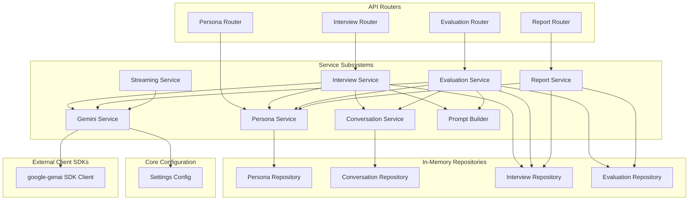
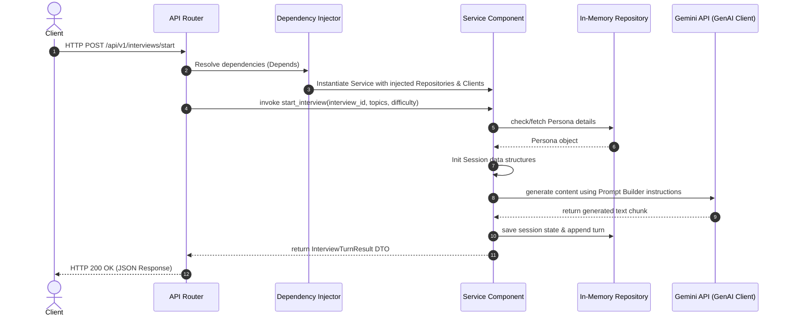
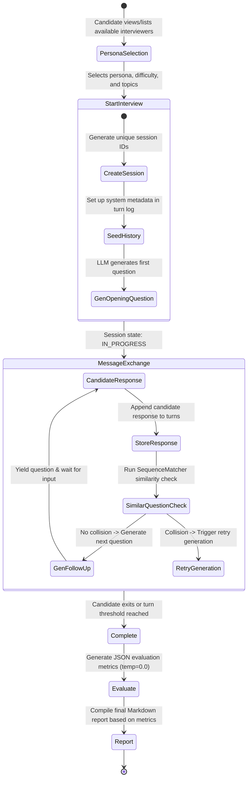

# InterviewVerse AI: System Architecture Documentation

Welcome to the **InterviewVerse AI** backend architecture documentation. This document serves as a comprehensive guide for future developers, code reviewers, internship evaluators, and open-source contributors to understand the design, engineering principles, data flow, and roadmap of the InterviewVerse AI system.

---

## 1. System Overview

**InterviewVerse AI** is a production-grade, asynchronous backend API built on FastAPI designed to simulate domain-specific technical and behavioral interviews. By leveraging advanced generative AI models (Gemini) through the official `google-genai` SDK, it provides candidates with realistic, dynamic, and adaptive interview sessions. At the end of each session, the engine evaluates the candidate's answers and generates a highly structured assessment report complete with topic-by-topic grading, strengths, weaknesses, and a personalized learning roadmap.

---

## 2. Project Goals

- **Realistic AI Roleplay**: Deliver highly differentiated interviewer personalities (e.g., warm HR managers, mathematically rigorous ML engineers, or pragmatic startup investors) that adapt to the candidate's input.
- **Dynamic & Non-Repetitive Questioning**: Real-time evaluation of conversation history to ensure follow-up questions build logically on previous responses and never repeat similar questions.
- **Rigorous Evaluation**: Synthesize full transcripts into structured, objective performance metrics using deterministic grading criteria.
- **Clean Architecture & Maintainability**: Strictly decouple API routing, business logic orchestration, prompt building, LLM clients, and data persistence layers.
- **Dependency Injection**: Utilize FastAPI's declarative dependency injection system for modularity, testability, and clean lifecycle management.

---

## 3. Directory Structure

The repository is organized following clean architectural principles:

```text
backend/
├── app/
│   ├── api/                    # Presentation Layer (Routers & Endpoints)
│   │   ├── evaluations/        # Evaluation API routes
│   │   ├── interviews/         # Interview workflow API routes
│   │   ├── personas/           # Persona listing API routes
│   │   ├── reports/            # Report synthesis API routes
│   │   ├── dependencies.py     # Central FastAPI Dependency Injection provider
│   │   ├── exceptions.py       # Global exception handler & HTTP translators
│   │   └── main.py             # FastAPI App definition & startup configuration
│   ├── core/                   # Core Infrastructure Config
│   │   ├── config.py           # Settings management via Pydantic Settings & env
│   │   └── logging.py          # Structured JSON logging configurations
│   ├── schemas/                # Data Transfer Objects (Pydantic validation schemas)
│   │   ├── evaluations.py
│   │   ├── interviews.py
│   │   ├── personas.py
│   │   └── reports.py
│   └── services/               # Core Business Logic Layer (Engine Subsystems)
│       └── ai/
│           ├── conversation/   # Handles conversation turns and history
│           ├── evaluation/     # Orchestrates full-interview evaluation
│           ├── gemini/         # High-level wrapper for Google GenAI SDK
│           ├── interview/      # Coordinates the high-level interview state machine
│           ├── personas/       # Manages interviewer profiles and behaviors
│           ├── prompts/        # Manages prompt templates, registries, and variables
│           ├── reports/        # Generates final markdown assessment reports
│           └── streaming/      # Handles incremental streaming response parsing
├── tests/                      # Automated Test Suite
│   ├── api/                    # Endpoint / API routing tests
│   ├── integration/            # Multi-service lifecycle workflow tests
│   └── services/               # Component-level isolated unit tests
├── requirements.txt            # Python production & development dependencies
└── pytest.ini                  # Pytest runner configurations
```

---

## 4. Service Architecture

The system is composed of eight specialized engines, each with distinct, single-responsibility boundaries:

### 1. Gemini Service
- **Location**: [`services/ai/gemini/`](file:///d:/PROJECTS/interviewverse-ai/backend/app/services/ai/gemini)
- **Role**: Wraps the official `google-genai` SDK Client. It handles low-level HTTP network calls, async streaming (`aio`), and implements robust transient error retry policies using `tenacity` (exponential backoff for rate limits `429` and server errors `5xx`). It maps raw API errors into clean, domain-specific exception models like `GeminiRateLimitError` or `GeminiGenerationError`.

### 2. Prompt Architecture
- **Location**: [`services/ai/prompts/`](file:///d:/PROJECTS/interviewverse-ai/backend/app/services/ai/prompts)
- **Role**: Standardizes how LLM instructions are stored, rendered, and validated.
  - `PromptTemplate`: Pydantic model enforcing structural properties of a prompt.
  - `PromptRegistry`: Bootstraps and registers prompt templates (e.g., `interview_generation`, `interview_evaluation`).
  - `PromptRenderer`: Substitutes template variables safely and verifies all required placeholders are supplied.
  - `PromptBuilder`: Orchestrates the registry and renderer to construct standard, validated `PromptPayload` payloads ready for LLM consumption.

### 3. Persona Engine
- **Location**: [`services/ai/personas/`](file:///d:/PROJECTS/interviewverse-ai/backend/app/services/ai/personas)
- **Role**: Manages profiles of the AI interviewers. It exposes enums (`PersonaType`) and structural models (`Persona`) representing different interviewers. It formats system instructions generically, ensuring the LLM is primed with specific styles, difficulty bounds, and focus topics without exposing builder internals.

### 4. Conversation Engine
- **Location**: [`services/ai/conversation/`](file:///d:/PROJECTS/interviewverse-ai/backend/app/services/ai/conversation)
- **Role**: Handles append-only transaction logs of conversation turns (Interviewer/Candidate). It translates raw model turns into LLM-ready message payloads and utilizes a Sequence Matcher to calculate question similarity metrics. If a newly generated question is structurally similar to an existing turn (above `0.8`), it flags a collision, triggering an automatic prompt regeneration.

### 5. Streaming Engine
- **Location**: [`services/ai/streaming/`](file:///d:/PROJECTS/interviewverse-ai/backend/app/services/ai/streaming)
- **Role**: Manages incremental token streaming. It decodes model chunks, checks sequence numbers, validates terminal chunk boundaries, and safely reconstructs the full text response while protecting client connections from intermediate timeout interruptions.

### 6. Interview Engine
- **Location**: [`services/ai/interview/`](file:///d:/PROJECTS/interviewverse-ai/backend/app/services/ai/interview)
- **Role**: The core coordinator orchestrating active sessions. It enforces interview transitions (e.g., preventing answering once an interview is marked `COMPLETED`), validates inputs, initiates new conversations, updates repositories, and runs retry loops (up to 4 attempts) to ensure all generated questions are unique and non-repetitive.

### 7. Evaluation Engine
- **Location**: [`services/ai/evaluation/`](file:///d:/PROJECTS/interviewverse-ai/backend/app/services/ai/evaluation)
- **Role**: Translates completed conversation transcripts into graded evaluations. It triggers Gemini with a deterministic temperature (`0.0`), injects structured evaluation JSON schemas in the prompt, robustly parses output JSON from markdown code fences or surrounding text, and instantiates structured Pydantic models mapping overall, communication, technical, and confidence scores.

### 8. Report Engine
- **Location**: [`services/ai/reports/`](file:///d:/PROJECTS/interviewverse-ai/backend/app/services/ai/reports)
- **Role**: Synthesizes evaluation and session data into user-facing markdown reports. It deterministically compiles executive summaries, formats score breakdowns, and generates markdown layouts (Strengths, Weaknesses, Roadmap) in a template-driven, non-hallucinated manner based purely on the generated evaluation schemas.

---

## 5. Dependency Graph

The following Mermaid diagram outlines the relationships and injection directions between routers, services, repositories, and external frameworks:



---

## 6. Request Lifecycle

The diagram below depicts the lifecycle of a standard API call, demonstrating the execution path from client request to final JSON serialization:



---

## 7. Interview Lifecycle

An interview session progresses through specific phases to guarantee conversation consistency, non-repetitive questions, structured evaluation, and clean reports:



---

## 8. Repository Architecture

Data management utilizes in-memory repositories to keep the system fast, self-contained, and decoupled from heavy database configurations. 

- **Singleton Pattern**: Repositories are instantiated as module-level lazy-initialized singletons. For example, in [`conversation/dependencies.py`](file:///d:/PROJECTS/interviewverse-ai/backend/app/services/ai/conversation/dependencies.py), the `get_conversation_repository()` function references a global `_conversation_repository` object. This ensures that throughout the entire application lifecycle, all requests access the same in-memory dictionaries, preserving conversation history across multiple REST API invocations.
- **Thread Safety & Sync Operations**: Since the backend executes tasks on standard asynchronous loops, data access uses dict mutations which are thread-safe under Python's Global Interpreter Lock (GIL) for synchronous operations.
- **Data Models**: Repositories are strictly typed, validating read/write objects via Pydantic before allowing memory mutations.

---

## 9. Dependency Injection Architecture

Dependency Injection (DI) is managed declaratively using FastAPI's `Depends` system.

- **Central Provider**: In [`api/dependencies.py`](file:///d:/PROJECTS/interviewverse-ai/backend/app/api/dependencies.py), factories assemble downstream dependency graphs. 
- **Decoupled Architecture**: Routers never instantiate services directly. They request them through `Depends(get_interview_service)`. This allows test configurations to easily swap concrete components (like swapping the real `GeminiClient` with a mock equivalent during unit testing) without touching route controllers.
- **Dynamic Configuration Injection**: Core system parameters such as `GEMINI_API_KEY`, model names, and temperatures are loaded dynamically from environment files via `pydantic-settings` and injected down to services.

---

## 10. Error Handling Strategy

InterviewVerse AI applies a tiered, domain-specific exception model translating custom business logic errors directly into standard HTTP statuses:

1. **Domain Exceptions**: Each service defines its own domain-specific errors (e.g., `PersonaNotFoundError`, `InterviewAlreadyCompletedError`, `EvaluationParsingError`).
2. **HTTP Translation**: Handlers are registered globally in [`api/exceptions.py`](file:///d:/PROJECTS/interviewverse-ai/backend/app/api/exceptions.py), catching custom domain exceptions and formatting them:
   - **`404 Not Found`**: Triggered when a persona, interview, or evaluation is missing (e.g., `InterviewNotFoundError`).
   - **`409 Conflict`**: Raised when attempting to mutate finished sessions (e.g., `InterviewAlreadyCompletedError`).
   - **`400 Bad Request`**: Raised during validation failures or structural inconsistencies (e.g., `InvalidPersonaError`, `InvalidEvaluationError`).
   - **`500 Internal Server Error`**: Catches explicit generation errors or failures in parsing AI JSON structures (e.g., `InterviewGenerationError`, `EvaluationParsingError`).

---

## 11. Testing Strategy

The test suite enforces structural code coverage and checks reliability across three core layers:

- **Unit Tests**: Isolated unit tests targeting individual services (such as verifying that `PromptBuilder` formats histories correctly or that `StreamingService` detects out-of-order chunks). Mocks are heavily utilized to decouple the tests from real Gemini API connections.
- **API Tests**: Validates routing, parameters validation, and exception mapping. Exposes `/health` endpoints and checks endpoint structures using `fastapi.testclient.TestClient`.
- **Integration Tests**: Tests the entire workflow end-to-end. Runs mock workflows from starting an interview, exchanging messages, completing the session, evaluating the output, and synthesizing the report.

### Current Test Statistics
All unit, API, and integration tests pass successfully:
- **Total Passing Tests**: `138 passed`
- **Execution Time**: `~12 seconds`
- **Configuration**: Configured in `pytest.ini` with custom filters to bypass Starlette deprecation warnings.

---

## 12. Future Production Roadmap

To scale InterviewVerse AI to a multi-tenant, high-throughput production environment, the following structural enhancements are planned:

### 1. Database Persistence
- **SQLAlchemy & PostgreSQL**: Replace the transient in-memory dictionaries with a robust relational database like PostgreSQL. Relational structures will store sessions, turns, evaluations, and reports linked by foreign keys.
- **Alembic**: Integrate database migration tools to manage structural schema upgrades.

### 2. Authentication & Authorization
- **JWT & OAuth2**: Implement token-based authentication using FastAPI Security utilities.
- **Role-Based Access Control (RBAC)**: Restrict access to administrative endpoints (such as updating persona definitions) to administrator roles, while allowing standard candidates to interact only with their own sessions.

### 3. Observability
- **Structured JSON Logging**: Streamline the current logging component to dump logs directly to centralized engines (like Datadog or ELK stack).
- **OpenTelemetry & Prometheus**: Instrument service methods with trace IDs to monitor round-trip latency to the Gemini API and collect operational metrics (e.g., rate limits, HTTP error counts, and queue depth).

### 4. Deployment
- **Dockerization**: Containerize the FastAPI backend via multi-stage Docker builds.
- **Kubernetes / Cloud Run**: Orchestrate container deployments, managing scaling, health checks, and secure secrets manager bindings for AI credentials.
- **CI/CD Pipeline**: Automate linters (`flake8`, `black`, `mypy`) and `pytest` execution on every pull request to ensure high code quality.
