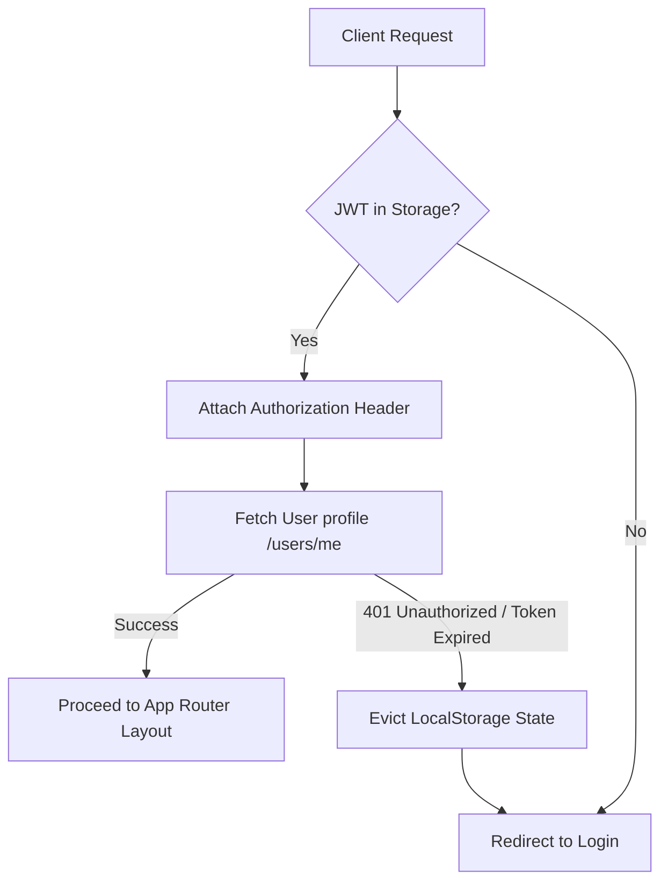

# Frontend Architecture Overview

This document defines the high-level frontend architecture for **InterviewVerse AI**. The frontend is built on **Next.js 15+**, **React 19+**, **TypeScript**, and **Tailwind CSS**.

---

## 1. Folder Structure

We use a hybrid folder structure combining **feature-based grouping** for scaling logic and **shared folders** for cross-cutting components, hooks, and styles.

```
frontend/
├── app/                      # Next.js App Router pages, layouts, and route handlers
│   ├── (auth)/               # Auth group (login, register)
│   ├── (dashboard)/          # Authenticated routes (dashboard, personas, history)
│   ├── interviews/           # Simulation sandbox screens
│   ├── layout.tsx            # Global layout wrapper
│   └── page.tsx              # Landing page
├── components/               # Shared UI elements (buttons, inputs, cards, dialogs)
│   └── ui/                   # Radix UI primitives configured with shadcn
├── features/                 # Modular system features (state, hooks, unique components)
│   ├── auth/                 # Auth store, login form, guards
│   ├── personas/             # Custom persona forms, library cards
│   ├── interviews/           # Chat container, timer, speech controls
│   └── reports/              # Markdown viewer, radar charts
├── hooks/                    # Reusable cross-feature hooks (useMediaQuery, useTheme, etc.)
├── lib/                      # External client setups (Axios, React Query configuration)
├── services/                 # API service boundary interfaces mapped to backends
├── store/                    # Global client-side state managers (Zustand slices)
├── types/                    # Common global TypeScript interfaces
└── styles/                   # CSS configurations (Tailwind directives, globals)
```

---

## 2. App Router Architecture

* **Layouts (`layout.tsx`)**: Define persistent UI skeletons (Sidebars, Headers) and providers (React Query, Auth Provider, Theme Provider). Prevents redundant re-renders.
* **Pages (`page.tsx`)**: Lightweight entry wrappers that coordinate feature components.
* **Loading States (`loading.tsx`)**: Next.js custom stream boundaries rendering shadcn skeleton loaders automatically during route transitions.
* **Error Boundaries (`error.tsx`)**: React boundary components capturing unexpected lifecycle errors, keeping the sidebar/layout functional while displaying retry components.

---

## 3. Client vs. Server Components Strategy

1. **Server Components (RSC) by Default**: All layout and page wrappers retrieve initial layouts, metadata, and static items directly on the server to optimize loading times.
2. **Client Components (`'use client'`)**: Leveraged for elements containing interactive hooks (`useState`, `useRef`, `useEffect`), form validations (React Hook Form), state managers (Zustand), dynamic layout animations (Framer Motion), or WebSocket/polling loops.

---

## 4. API & Network Layer

We utilize **Axios** as our primary HTTP client.
* **Base Client Config**: Configured with request timeouts, default headers, and JSON serialization.
* **Request Interceptor**: Automatically attaches the JWT token from storage to the `Authorization: Bearer <token>` header if present.
* **Response Interceptor**: Automatically catches `401 Unauthorized` responses and fires token eviction events, prompting user redirections.

---

## 5. Authentication & Protected Routes



* **Storage**: Store the access token in a cookie or `localStorage` to ensure persistence across sessions.
* **Guards**: Next.js **Middleware** intercepts incoming route changes. If the target path resides under `(dashboard)/` or `interviews/` and no token is present, it issues a rewrite redirection to `/login`.

---

## 6. State Management & Data Fetching

We separate state based on lifespan and synchronization needs:

1. **Server State (TanStack Query / React Query)**:
   * Handles caching, background invalidations, loading states, and mutations for all API entities.
   * **Cache Strategy**: Default `staleTime` of 5 minutes. Cache is invalidated on mutations (e.g. creating a persona triggers a `.invalidateQueries(['personas'])` call).
2. **Client State (Zustand)**:
   * Handles local UI state: sidebar toggle status, active simulation audio state, dynamic theme preferences, and user preferences.

---

## 7. Form & Validation Architecture

* **React Hook Form**: Handles state inputs, focusing, and submission lifecycles.
* **Zod Validation Schemas**: Compiles client-side verification constraints (matching database constraints: email validations, text length requirements, etc.).
* **Error Propagation**: Integrates directly with Tailwind styles to outline inputs in error states and display inline descriptions.

---

## 8. Error Handling & Toast Architecture

* **Global Boundary**: Captures unexpected execution page crashes.
* **API Error Parser**: Intercepts HTTP errors and transforms them into user-facing localized feedback.
* **Toast Notification Engine**: Leverages shadcn's toaster to render float overlays for minor operational exceptions (e.g. API limit warning, network timeout).
