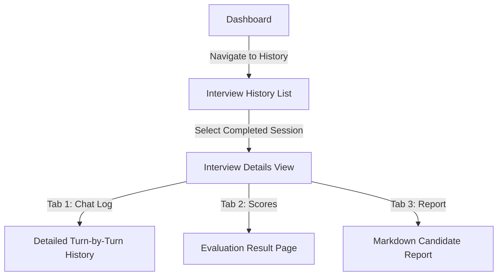

# Frontend User Flows & Journeys

This document outlines the visual navigation states and user journeys for the **InterviewVerse AI** platform.

---

## 1. User Registration & Onboarding Flow

Provides the entry funnel for new candidates.

```mermaid
graph TD
    A[Landing Page] -->|Click Get Started| B[Registration Page]
    B -->|Submit Form - POST /auth/register| C{Validation Success?}
    C -- No -->|Display Inline Errors| B
    C -- Yes --> D[Login Page]
    D -->|Submit Form - POST /auth/login| E{Credentials Valid?}
    E -- No -->|Display Error Toast| D
    E -- Yes -->|Store JWT & Redirect| F[Dashboard]
```

* **Step 1 (Landing)**: Marketing site displaying call-to-actions (CTAs), pricing details, and capability highlights.
* **Step 2 (Registration)**: Input full name, email, and password. Handled by client-side Zod validation.
* **Step 3 (Authentication)**: Submits email/password to retrieve bearer token, saved in client local storage.
* **Step 4 (Dashboard Redirect)**: First-time loading screen initializing user context.

---

## 2. Mock Interview Simulation Flow

The primary interactive simulation flow.

```mermaid
graph TD
    A[Dashboard] -->|Click New Session| B[Persona Library]
    B -->|Select Interviewer Persona| C[Interview Sandbox Setup]
    C -->|Click Start Interview - POST /interviews/start| D[Active Interview Screen]
    D -->|Input Answer & Send - POST /interviews/:id/message| E{Is Turn Count < 5?}
    E -- Yes -->|Get Next Question| D
    E -- No / Max Turns Met --> F[Complete Session - POST /interviews/:id/complete]
    F -->|Submit Evaluation - POST /interviews/:id/evaluate| G[Evaluation Screen]
    G -->|Navigate to Report| H[Report Screen]
```

* **Step 1 (Persona Selection)**: Displays public and custom personas in grid layouts.
* **Step 2 (Sandbox Configuration)**: Candidate selects difficulty (junior, mid, senior) and focus topics.
* **Step 3 (Active Simulation Chat)**: Chat interface displaying interviewer messages (from API) and candidate response inputs.
* **Step 4 (Evaluation Generation)**: Automatically triggered upon interview completion. Calls LLM parser to output qualitative score spreads.
* **Step 5 (Candidate Report)**: Renders final markdown summary and hiring recommendations.

---

## 3. Custom Persona Creation Flow

Allows users to build and run customized interview personas.

```mermaid
graph TD
    A[Dashboard] -->|Navigate to Personas| B[Custom Persona Builder]
    B -->|Fill Configuration Form| C{Valid Details?}
    C -- No -->|Show Field Highlights| B
    C -- Yes -->|Save Persona - POST /personas| D[Persona Library Grid]
    D -->|Click Use Custom Persona| E[Interview Sandbox Setup]
```

* **Step 1**: Fill in name, role title, system prompt context (e.g. "A tough compiler design lead"), topics list, and styles.
* **Step 2**: Save triggers db entry with owner user boundary association.
* **Step 3**: Custom persona immediately shows up in the user's Persona Library.

---

## 4. History & Performance Review Flow

Allows users to review past interview performance.



* **Step 1**: Lists past sessions with metadata (persona name, creation date, status).
* **Step 2**: Details view pulls message history, score metrics, and static reports.

---

## 5. Exception & Error Flows

Handling failures gracefully on the UI.

### Expired JWT Token
* **Trigger**: A query or mutation returns `401 Unauthorized`.
* **Action**: Response interceptor evicts JWT token, halts active states, pushes an alert toast ("Session expired. Please log in again"), and redirects to `/login`.

### Network Connection Loss
* **Trigger**: Axios client throws a network unreachable error.
* **Action**: Renders a floating indicator overlay ("Connection lost. Reconnecting..."). Active chat inputs are temporarily disabled to prevent data loss.

### Gemini API / Generation Failures
* **Trigger**: Submitting a response message returns `500 Internal Server Error` with `InterviewGenerationError`.
* **Action**: Displays retry warning in chat feed ("The interviewer had trouble responding. Click here to resend your message").
* **UX Safety**: The candidate's text remains in the input field so they don't have to retype it.
